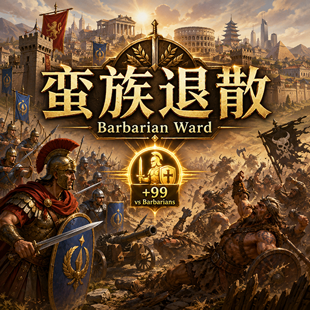
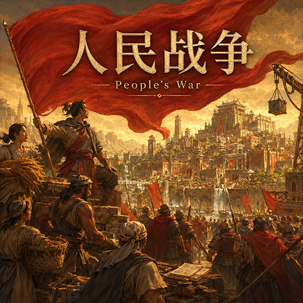

# 文明 VI Mods

[English](README.en.md)

## 仓库介绍

该仓库收集我实现的 [文明 VI](https://civilization.2k.com/civ-vi/) mod。这些 mod 可在 [Steam 创意工坊](https://steamcommunity.com/app/289070/workshop/)下载，也可自行 clone 本仓库后，将需要的 mod 文件夹放到对应的《文明 VI》mod 文件夹下使用。

本地 mod 文件夹一般为 `%USERNAME%\Documents\My Games\Sid Meier's Civilization VI\Mods` 。

## 各 mod 介绍

### 额外政策槽位

对应文件夹：`AdditionalPolicySlots`

人类玩家拥有对应市政后，提供额外政策槽位：

- 拥有「军事传统」市政：加一军事政策槽位。
- 拥有「对外贸易」市政：加一经济政策槽位。
- 拥有「政治哲学」市政：加一外交政策槽位。
- 拥有「神秘主义」市政：加一通配符政策槽位。

该效果不会影响 AI 玩家。

### 蛮族退散

对应文件夹：`BarbarianWard`

人类战斗单位与蛮族单位战斗时获得 99 战斗力增益。

### 人类单位移动力增强

对应文件夹：`MovementEnhance`

本 mod 为人类玩家提供全局单位移动力加成。启用后，所有由人类玩家控制的单位将额外获得 1 点移动力。该效果不会影响 AI 玩家。

### 开局科技与市政完成

对应文件夹：`OpeningTechsAndCivicCompletion`

远古时代开局时，人类主要玩家进入游戏后的首个回合开始时，立即完成以下开局科技与市政：

- 科技：制陶术、畜牧业、采矿、航海术、占星术。
- 市政：法典。

该效果只会触发一次，不会影响 AI 玩家。非远古时代开局时，该效果不会触发。

### 人民战争

对应文件夹：`PeoplesWar`

仅在“风云变幻”规则集下，为人类主要玩家提供以下效果：

- 根据帝国总人口提高普通与宗教战斗力：总人口 1–10 时为 +1，11–20 时为 +2，以此类推，最高为 +100。
- 每座城市按自身人口提高远程攻击力、城市防御力和反间谍等级：人口 1–10 时为 +1，11–20 时为 +2，以此类推；人口达到 91 后固定为 +10。
- 征服城市时不会损失人口。
- 新征服或因忠诚度归附的城市可以选择“解放”，其效果为：“撤销该城市的城市建制，并将全部人口重新分配至帝国其他已确定保留的城市。无法均分的余数依次分配给其中人口最少的城市，每座城市一个人口。”

以上效果不会赋予 AI 玩家。

### 人口产出

对应文件夹：`PopulationYields`

仅在“迭起兴衰”和“风云变幻”规则集下，每座城市每人口额外提供 +2 金币、+0.5 生产力、+1 信仰、+0.5 科技和 +0.5 文化。

该效果仅影响人类主要玩家，不会影响 AI 玩家。

### 夷平原始首都

对应文件夹：`RazeOriginalCapital`

通过修改全局配置，可夷平任意城市，对人类玩家和 AI 都生效。

### 人类单位视野增强

对应文件夹：`SightEnhance`

本 mod 为人类玩家单位提供全局视野范围加成。所有由人类玩家控制的单位将额外获得 1 点视野。可与若昂三世的关闸叠加。该效果不会影响 AI 玩家。

## 版权协议

本仓库使用 [Apache License 2.0](LICENSE.txt)。
